

# BigClown Enclosures

This repository contains STL models of BigClown enclosures. These model have been optimized for 3D printing.

# Overview

The model marking consists of the following format `BCExyy` and optional suffix `A`, `B`, etc. in case of multi-part models. The number `x` represents the basic structure and the number `yy` represents its variant. For fixing poth pars can be used specified rubber O-ring.

> Note: Suffix `A` denotes the base part.

The following table lists the available models:

| Model  | Type     | Module Count | Sigfox | O-ring  | Module Configuration                                                                      | Picture                                  |
|--------|----------|:------------:|--------|---------|-------------------------------------------------------------------------------------------|------------------------------------------|
| BCE101 | Narrow   | 3            | No     | 45x2 mm | Mini Cover Module Core Module Mini Battery Module                                   |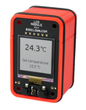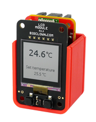|
| BCE102 | Narrow   | 4            | Yes    | 45x2 mm | Mini Cover Module Core Module Sigfox Module Mini Battery Module                  |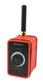                     |
| BCE104 | Narrow   | 5            | Yes    | 45x2 mm | Mini Cover Module Core Module Sensor Module Sigfox Module Mini Battery Module |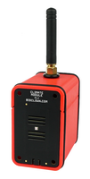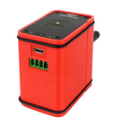|
| BCE201 | Wide (*1)| 4            | No     | 70x2 mm | Cover Module Core Module CO2 Module Battery Module                               |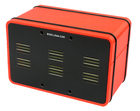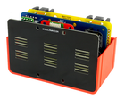|
| BCE202 | Wide     | 5            | Yes    | 70x2 mm | Cover Module Core Module Sigfox Module CO2 Module Battery Module              |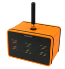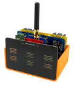|
| BCE203 | Wide     | 4            | No     | 70x2 mm | LCD Module Core Module CO2 Module Battery Module                                 |                     |
| BCE301 | Wide     | 3            | No     | 70x2 mm | Cover Module Core Module Power Module                                               |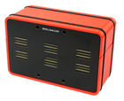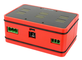|
| BCE303 | Wide     | 3            | No     | 70x2 mm | Cover Module Core Module Battery Module                                             |                                          |
| BCE501 | Custom   | 3            | Yes    | No      | Core Module Sensor Module Mini Battery Module Flood Sensor LD81                  |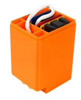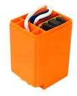|

> Enclosures are optimized for last version of Modules using 2.5 mm pin header plastic housing except note *1.
> All models are tested and optimized for 3D printer Prusa I3 MK2, print resolution 0.2 mm or better.

> Note *1: Micro USB connector position is optimized for old low profile version of Core Module with 1.5 mm pin header housing, but 2.5 mm version is usable too.

# License

This project is licensed under the [Attribution-ShareAlike 4.0 International](https://creativecommons.org/licenses/by-sa/4.0/) - see the [LICENSE](LICENSE) file for details.

---

Made with &#x2764;&nbsp; by [BigClown Labs s.r.o.](https://www.bigclown.com) in Czech Republic.
